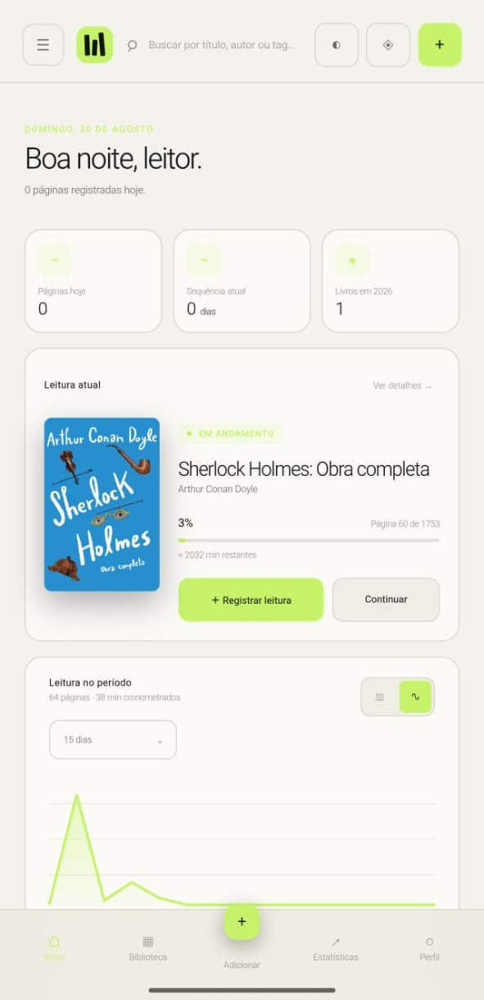
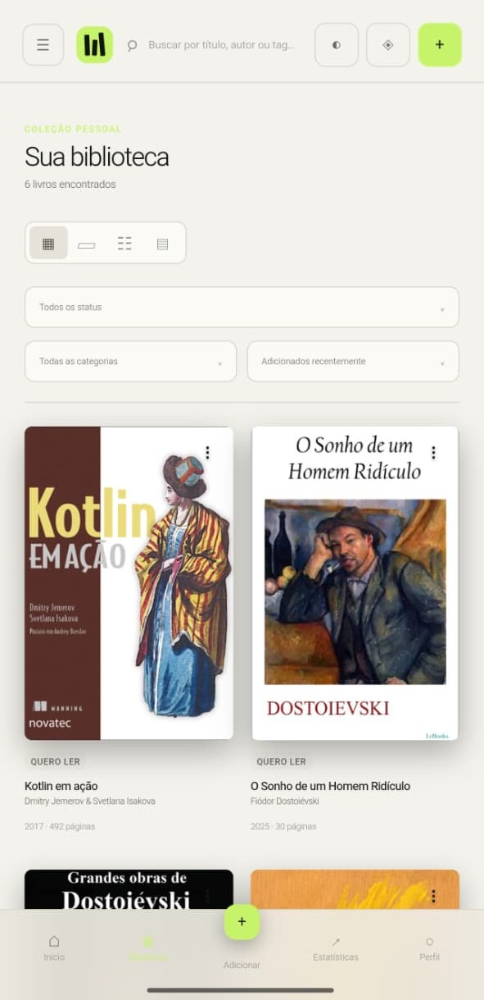
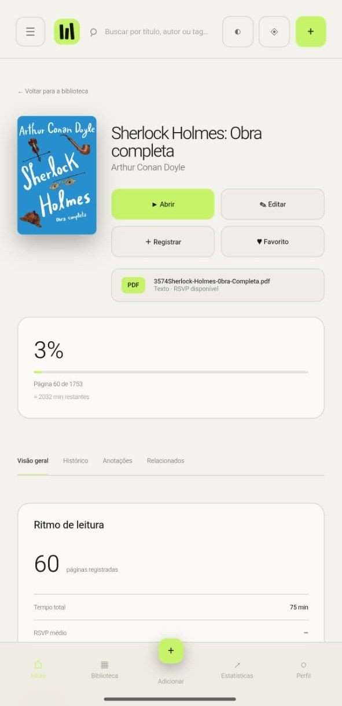
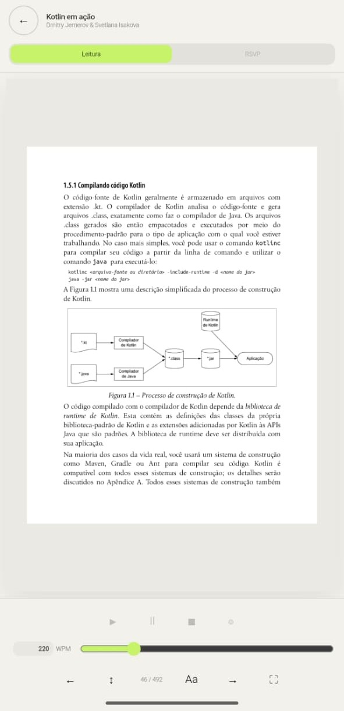
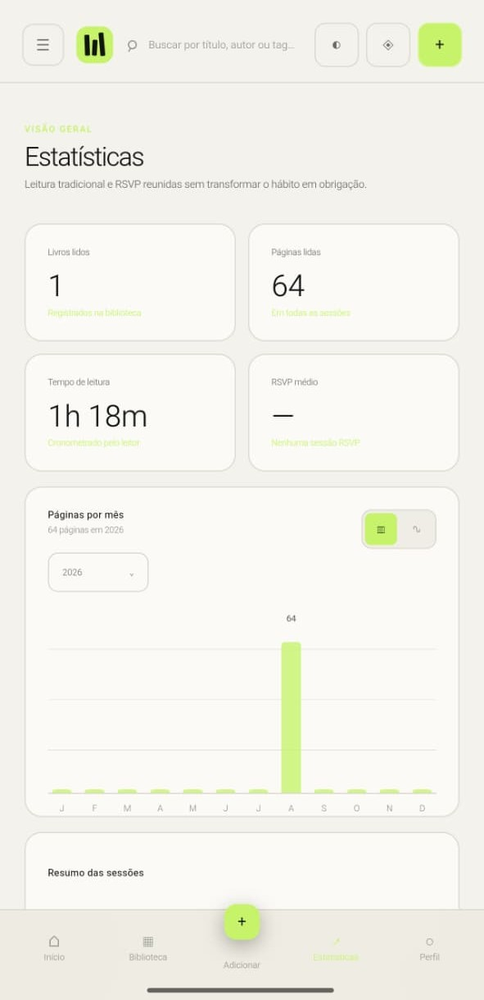
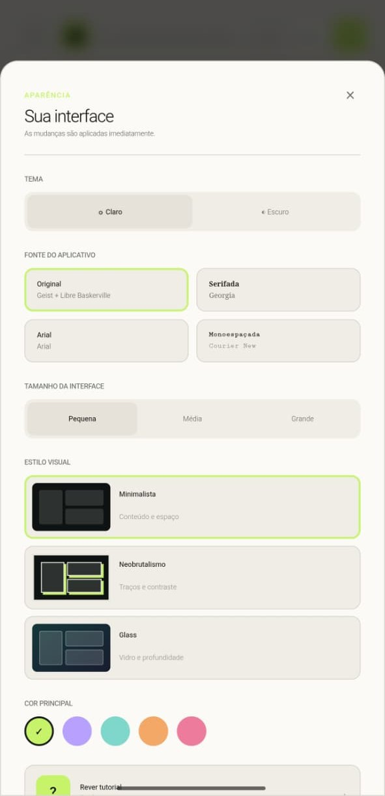
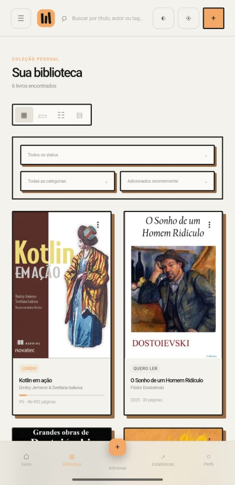
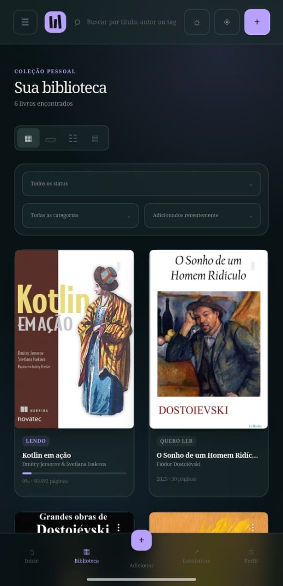

# MyBookshelf

A local-first, cross-platform reading management application built with React and TypeScript, designed to provide a focused reading experience across web and Android.

## About

MyBookshelf is a personal reading platform focused on managing books, tracking reading progress, and providing different reading experiences in a single application.

The project follows a local-first approach, allowing essential reading data and application functionality to remain available on the device while being structured for future synchronization, backup, and integrations.

The application is currently being developed for Web, PWA, and Android.

| Home | Library |
| --- | --- |
|  |  |

## Features

- Personal book library with multiple visualization modes
- Book metadata and individual book pages
- Reading progress tracking
- Reading history and statistics
- Traditional reading mode
- RSVP (Rapid Serial Visual Presentation) reading mode
- Reading annotations and notes
- Reading goals and progress tracking
- Automatic local data persistence
- Offline support
- PWA installation
- Android application through Capacitor
- Responsive layouts for smartphone, tablet, desktop, and ultrawide displays
- Customizable themes and visual styles
- Light and dark modes
- Multiple interface font options
- Open Library integration
- PDF-based reading
- Architecture prepared for future synchronization, backup, and external integrations

## Technologies

- React
- TypeScript
- Next.js
- Capacitor
- IndexedDB
- Cloudflare D1
- PDF.js
- Progressive Web App (PWA)
- Native Android integration

## Architecture

MyBookshelf uses a local-first architecture designed around keeping the core reading experience available on the user's device.

```text
Web Application
      │
      ├── React
      ├── TypeScript
      └── Next.js
             │
             ├── Local Storage
             │     └── IndexedDB
             │
             ├── PWA
             │
             └── Android
                   └── Capacitor
```

The project also includes a Cloudflare D1 layer for structured application data and an architecture designed to support future synchronization and external integrations.

## Reading Experience

The reader provides two main reading approaches:

| Book Details | PDF Reader |
| --- | --- |
|  |  |

### Traditional Reading

A conventional document-based reading interface with page tracking and reading progress.

### RSVP

A Rapid Serial Visual Presentation mode designed for focused reading and adjustable reading speed.

The reading system is being developed alongside progress tracking so that reading sessions can be recorded consistently across the different reading modes.

### Statistics & Customization

| Statistics | Interface Configuration |
| --- | --- |
|  |  |

## Interface

The application includes three visual styles:

| Minimalist | Neobrutalism | Glass — Dark |
| --- | --- | --- |
|  |  |  |

It also supports:

- Light and dark themes
- Multiple accent colors
- Responsive layouts
- Adjustable interface size
- Multiple application fonts

## Development

### Requirements

- Node.js 22.13 or later
- pnpm

### Installation

```bash
pnpm install
```

### Development server

```bash
pnpm dev
```

### Production build

```bash
pnpm build
```

### Tests

```bash
pnpm test
```

## Android

The Android version is built through Capacitor.

To generate the Android application:

```bash
pnpm mobile:apk
```

The generated debug APK is placed under:

```text
android/app/build/outputs/apk/debug/
```

## Web Release

Guide: How to Load the Web Version


## Project Status

MyBookshelf is currently under active development.

The current focus is improving the reading experience, Android support, local-first data management, and the foundation for future integrations.

## Roadmap

Planned development includes:

- Improved synchronization architecture
- Backup and data portability
- Expanded reading statistics
- Additional reading tools
- Further Android integration
- Additional external integrations

## License

This project is currently intended as a personal development and portfolio project.
